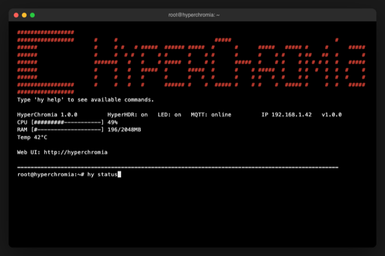

# HyperChromia

A read-only, power-loss-safe appliance OS for [HyperHDR](https://github.com/awawa-dev/HyperHDR),
built on Buildroot.

[](https://github.com/tux-84/hyperchromia/releases)
[](https://github.com/tux-84/hyperchromia/actions/workflows/pr-check.yml)
[](https://github.com/awawa-dev/HyperHDR/releases)
[](https://github.com/buildroot/buildroot/tree/2026.08)

<br clear="left"/>



## Features

- **Read-only root.** SquashFS `SYSTEM` partition + a writable `DATA` partition for
  everything that actually changes at runtime. Pulling the power never corrupts the OS.
- **`hy` CLI.** `restart`, `net`, `netconfig` (incl. Wi-Fi), `backup`, `restore`, `upgrade`,
  `factoryreset`, `password`, `setup`, `reboot`, `poweroff` — tab-completion included.
- **Branded console.** Auto-login, logo, a live status header (CPU/RAM/uptime/IP/version)
  pinned to the top of the screen.
- **Self-contained upgrades.** `hy upgrade` fetches, verifies, and installs HyperHDR's
  own official release — no package manager, no OS rebuild required.
- **Home Assistant integration.** Point HyperChromia at your MQTT broker and it shows up in
  Home Assistant on its own, with buttons and status sensors. If the box goes offline,
  Home Assistant notices (see below).
- **Broad hardware target.** UEFI boot, generic PC kernel config — not tied to one
  specific mini-PC model.

## Benchmarks

Measured on a Dell Wyse 3040 (Intel Atom x5-Z8350, quad-core, fanless) running HyperHDR under
HyperChromia, capturing and processing a Full HD source at 60 FPS. CPU usage is aggregate across
all cores (100% = every core fully busy), on both the Wyse 3040 and the Pi 2/3/4 (both quad-core):

| Metric | HyperChromia on Dell Wyse 3040 | Raspberry Pi (community-reported) |
|---|---|---|
| Resolution / frame rate | 1920×1080 @ 60 FPS | 1920×1080 @ 30-60 FPS |
| CPU usage | ~49% | ~50-75% (Pi 2/3/4) |
| RAM usage (total system, OS + HyperHDR) | ~196 MB | ~320-330 MB (Pi 4, per HyperHDR's maintainer) |

### Used hardware cost (October 2026)

| Device | Typical used price | Notes |
|---|---|---|
| Dell Wyse 3040 | ~$20-30 | Complete unit — RAM/storage included, often with PSU |
| Raspberry Pi 4 | ~$65-100 | With PSU + SD card, to match a complete unit |
| Raspberry Pi 5 | ~$100-160 | With PSU + SD card, to match a complete unit |

## Quick start

```bash
git clone git@github.com:tux-84/hyperchromia.git
cd hyperchromia
./install.sh
```

`install.sh` asks what you want: build only (`factory.img`/`update.img`, no USB), or build and
flash a USB stick directly. Everything builds inside an isolated Docker container, so it works
the same on any host architecture — macOS and Linux are both supported for the USB-flashing
path. Pass `-v`/`--verbose` to see full build/flash output instead of the default progress bar.

### Installing a new device (USB installer, recommended)

```bash
./install.sh   # choose 2) Create a USB stick, then "Factory/installer stick"
```

You'll be asked for hostname, network (DHCP/static), Wi-Fi, root password (or rely on an SSH
key — see Configuration below), MQTT broker, and console keymap, all on your own machine — no
screen or keyboard needed on the target device afterwards. The script then builds the image and
flashes it to a removable USB device you pick (only genuinely removable disks are ever listed).

Plug that USB stick into the target machine and power it on. It partitions the target's internal
disk, installs HyperChromia with your settings pre-baked, then **powers off** — remove the USB stick
and power the machine back on. It boots straight into a fully configured HyperChromia, no interaction
required.

### Manual install (advanced)

If you'd rather `dd` directly onto a drive you've pulled out of the machine:

```bash
# macOS
diskutil list                                  # find the target disk, e.g. /dev/disk4
diskutil unmountDisk /dev/disk4
sudo dd if=factory.img of=/dev/rdisk4 bs=4m status=progress
diskutil eject /dev/disk4

# Linux
lsblk                                          # find the target disk, e.g. /dev/sdb
sudo dd if=factory.img of=/dev/sdb bs=4M status=progress conv=fsync
sync
```

**Double-check the device path — this overwrites the entire target drive.** The drive boots
directly via UEFI into HyperChromia; first boot applies whatever preseed was baked in at build time
(or the defaults, if none was given).

### Updating an already-deployed device

HyperChromia keeps two copies of its SYSTEM partition (A/B slots) and applies updates to whichever
one isn't currently running, so a failed or interrupted update never leaves the device
unbootable — GRUB automatically falls back to the last-known-good slot. Your HyperHDR settings,
backups, and `hy`-managed configuration all live on a separate DATA partition that an update
never touches.

To update a device: `./install.sh` → 2) Create a USB stick → "Update stick" (no config needed),
or `dd` `update.img` onto a spare USB stick (or any spare disk) yourself. Attach it to the
device and power-cycle. HyperChromia detects it at boot, verifies it, applies it to the inactive
slot, and reboots into the new version. The stick can be left attached — HyperChromia won't reapply
an already-installed version.

## `hy` CLI reference

| Command | Description |
|---|---|
| `hy restart` | Restart HyperHDR, verify it comes back up |
| `hy net` | Show network diagnostics (read-only) |
| `hy netconfig` | Change IP mode (DHCP/static) or hostname |
| `hy backup` | Archive the current HyperHDR install |
| `hy restore [archive]` | Restore a backup (defaults to the most recent) |
| `hy upgrade` | Check for and install a newer HyperHDR version |
| `hy factoryreset` | **Destructive.** Reset HyperHDR back to factory defaults |
| `hy password` | Change the root password |
| `hy locale` | Try, then optionally save, a console keyboard layout |
| `hy mqtt` | Configure the MQTT bridge (Home Assistant) |
| `hy reboot` / `hy poweroff` | Self-explanatory |

## Home Assistant integration

Run `hy mqtt` and enter your broker's host, port, username, and password (leave the host blank
to turn it off again). That's it — no YAML, no manual entity setup. A "HyperChromia" device shows up
in Home Assistant under Settings → Devices & Services → MQTT, with:

- Buttons to reboot, power off, or restart HyperHDR
- Sensors for whether HyperHDR is running, whether the LED device is on, and whether the box
  itself is reachable

If HyperChromia loses power or drops off the network, Home Assistant marks it (and its entities)
offline automatically — you don't need to do anything for that to work.

## Configuration

`config.env` at the repo root:

```bash
HYPERCHROMIA_DEFAULT_HOSTNAME=hyperchromia
HYPERHDR_DEFAULT_VERSION=latest
```

There is no static default root password. Add your own SSH public key to `authorized_keys`
at the repo root (gitignored — never commit a real key here) for key-based root login with
password login disabled, or set a password through the USB installer's factory setup prompts
(`./install.sh` → 2 → factory), applied automatically on first boot. A build with neither will
warn you: that image would have no way to log in as root at all. Change the password later any
time with `hy password`.

## Project layout

```
hyperchromia/
├── install.sh                   entry point: build only, or build + flash a USB stick
├── config.env                   build-time defaults (hostname, HyperHDR version)
├── authorized_keys              your SSH public key(s), gitignored
├── VERSION                      release version
├── scripts/
│   ├── build.sh                 build script
│   └── make-usb.sh              USB installer/updater stick builder
└── build/                       Buildroot external tree
    ├── assets/                  README images
    ├── board/                   kernel config, partition layout, boot scripts
    └── package/hyperhdr/        HyperHDR build recipe
```

## Contributing

Commits follow [Conventional Commits](https://www.conventionalcommits.org/)
(`feat:`, `fix:`, `chore:`, ...); [commitizen](https://commitizen-tools.github.io/commitizen/)
is supported (`cz commit`). Work happens on `develop` and lands on `master` via pull
request — CI runs shellcheck, commitlint, and a secret scan on every PR, and releases are
automated from Conventional Commit history via release-please.

Keep `master` free of drift: only `feat:`/`fix:` commits (via release-please's own version-bump
PR) and unavoidable `chore:`/`docs:` merges should land there. Every non-release commit pushes
`master`'s tip past the last tag, so a build off `master` shows `vX.Y.Z-dev` until the next
release — expected between releases, but avoid piling up chores on `master` when they could
wait and go out with the next real release instead.
